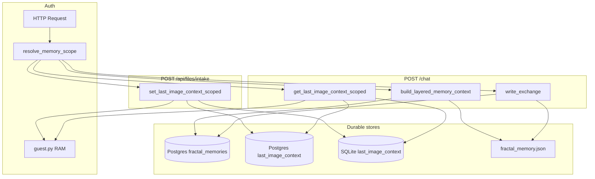

# Memory Audit V16 — COCO user-scoped storage

Audit date: 2026-06-10. Scope: isolation, traceability, compression/retrieval readiness.
Does **not** add Subquadratic, student dashboard, or provider routing changes.

## Central scope resolver

| Module | Role |
|--------|------|
| `app/memory/memory_scope.py` | `resolve_memory_scope(request)` → `MemoryScope` |

`MemoryScope` fields:

| Field | Meaning |
|-------|---------|
| `scope_kind` | `guest` \| `user` \| `owner` \| `anon` |
| `user_id` | DB user id when authenticated |
| `guest_session_id` | `X-Guest-Session` value for guests |
| `conversation_id` | Optional `X-Conversation-Id` header (reserved; not persisted yet) |
| `context_key` | Image context / session key: `guest:{id}`, `user:{id}`, … |
| `fractal_user_key` | Fractal memory key: `guest-{sid[:28]}`, `user-{id}` |

Logs (non-sensitive): `memory_scope_resolved`, `memory_read_scope`, `memory_write_scope`, `memory_cross_scope_blocked`.

---

## Storage inventory

### 1. Guest session (quota + RAM image mirror)

| | |
|---|---|
| **Module** | `app/auth/guest.py` |
| **Keys** | `session_id` (= `guest_session_id`), `ip`, `message_count`, `date_key`, `last_image_context` |
| **Lifetime** | In-process; purge after 24h idle; max 5 sessions / IP |
| **Persistence** | Volatile (worker RAM) |
| **Cross-user risk** | Low if `session_id` + `ip` match on quota check; image mirror duplicated from durable store |

### 2. Authenticated users (accounts)

| | |
|---|---|
| **Module** | `app/auth/database.py` |
| **Keys** | `users.id`, `email`, JWT `sub` |
| **Lifetime** | Durable SQLite (`OPENCHAWN_DB_PATH`) |
| **Persistence** | Durable |
| **Cross-user risk** | Low — row-level by `id`; no shared conversation table |

### 3. Official chat memory (fractal)

| | |
|---|---|
| **Module** | `app/memory/fractal_memory.py` |
| **Wired from** | `app/api/chat.py` → `build_layered_memory_context` (read), `write_exchange` (write) |
| **Keys** | `fractal_user_key` stored as entry `user_id`; `project_name`, `memory_type` |
| **Lifetime** | Durable when `MEMORY_BACKEND=postgres`; else JSON file (dev) |
| **Persistence** | Postgres `fractal_memories` or `data/memory/fractal_memory.json` |
| **Cross-user risk** | Medium if wrong `user_key` passed — mitigated by `MemoryScope.fractal_user_key` |

### 4. Last image context (file intake summaries)

| | |
|---|---|
| **Module** | `app/files_intake/session_image_context.py`, `image_context_persistence.py` |
| **Keys** | `context_key` (= `MemoryScope.context_key`); payload `media_id`, `description`, … |
| **Lifetime** | Until replaced by next upload in same scope; no TTL yet |
| **Persistence** | Postgres → SQLite → RAM fallback (+ guest RAM mirror) |
| **Cross-user risk** | Low when reads use scoped `context_key`; `media_id` alone does not grant access |

### 5. File intake API

| | |
|---|---|
| **Module** | `app/api/files_intake.py` |
| **Keys** | `context_key`, returns `media_id` to client |
| **Persistence** | Structured summary only (`stored: false` for bytes) |
| **Cross-user risk** | Low — auth gate + scoped write |

### 6. Chat image injection

| | |
|---|---|
| **Module** | `app/api/chat.py` |
| **Keys** | `context_key`, optional request `media_id` must match stored context |
| **Cross-user risk** | Low — context loaded only from caller's scope; foreign `media_id` blocked |

### 7. Browser client (not server memory)

| | |
|---|---|
| **Module** | `static/index.html` |
| **Keys** | `sessionStorage`: `oc_guest_session`, `oc_token`; `pendingImageAttachment.media_id` |
| **Persistence** | Browser session |
| **Cross-user risk** | N/A (client-side only) |

### 8. MemPalace (parallel / non-official)

| | |
|---|---|
| **Module** | `app/mempalace/store.py` |
| **Keys** | `project`, `type` — **no per-user key** |
| **Persistence** | JSON `data/mempalace/memories.json` |
| **Cross-user risk** | **High** if enabled globally — **not** on official `POST /chat` path |

### 9. Legacy conversation JSON / JSONL

| | |
|---|---|
| **Modules** | `app/memory/store.py`, `app/memory.py`, `memory/fractal_memory.py` |
| **Keys** | Per-file `user_id` or global append |
| **Persistence** | Local files |
| **Cross-user risk** | Not wired to production chat — see `docs/OPENCHAWN_MEMORY_MAP_V11_7.md` |

### 10. Auxiliary fractal stores (derived)

| Module | Keys | Persistence | User scope |
|--------|------|-------------|------------|
| `memory_timeline.py` | `user_key`, `session_id` in events | JSON file | Per `user_key` in metadata |
| `faiss_memory.py` | entry `id` | Index files | Filtered by project, not user |
| `embedding_cache.py` | text hash | JSON | Global |
| `graph_persistence.py` | memory `id` | JSON snapshot | Derived from fractal entries |

### 11. Operational (non-conversation)

| Module | Keys | Scope |
|--------|------|-------|
| `app/middleware.py` | rate-limit actor | Per IP / guest session / token hash |
| `app/qei/logger.py` | `user_id` | Daily JSON logs |

---

## Key namespace alignment

| Actor | Image context (`context_key`) | Fractal (`fractal_user_key`) |
|-------|------------------------------|------------------------------|
| Guest `guest_abc…` | `guest:guest_abc…` | `guest-guest_abc…` (28 chars) |
| User `42` | `user:42` | `user-42` |
| Owner | `owner:{ip}` | `user-owner-robert` |

`session_key_from_user()` remains a thin alias of `MemoryScope.context_key`.

---

## Current architecture (official path)

---

## Gaps and recommendations (no code in this PR unless noted)

| Gap | Status | Recommendation |
|-----|--------|----------------|
| No `conversation_id` persistence | Open | Header captured in `MemoryScope`; future thread table |
| Two key prefixes (`guest:` vs `guest-`) | Documented | Use `memory_scope.py` only |
| MemPalace global store | Open | Do not wire to chat without user scoping |
| `GET /history` unwired | Open | Fix or remove dead endpoint |
| Image context TTL | Open | Add retention policy in future PR |
| Compression / Subquadratic | Out of scope V16 | Future student memory PR |

---

## Verification checklist

- [x] `resolve_memory_scope(request)` implemented
- [x] Scoped image context read/write helpers
- [x] Chat uses `MemoryScope` for fractal + image keys
- [x] Isolation tests: user A ≠ user B, guest A ≠ guest B, `media_id` cross-scope blocked
- [x] Structured scope logs

Official chat path reference: `docs/OPENCHAWN_MEMORY_MAP_V11_7.md`.
